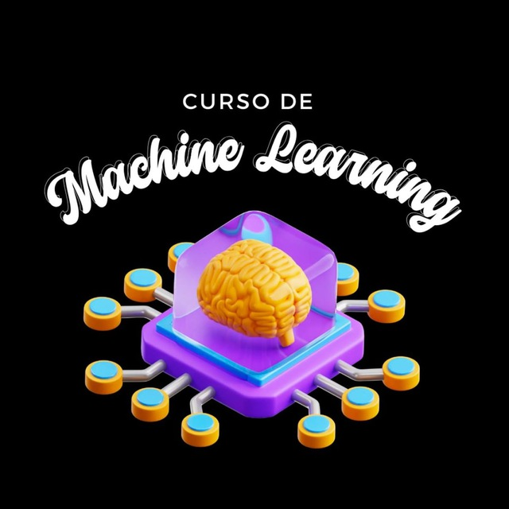

# Curso de Machine Learning 2025

  

**Horário:** 14:20 às 16:00  
**Local:** Auditório Fernão Stella de Rodrigues Germano do ICMC, Bloco 6  
**Datas:** Todas as sextas-feiras, de 21/03/2025 a 02/05/2025  
**Transmissão ao vivo:** [DataICMC no YouTube](https://www.youtube.com/@DataICMC)

## Informações Importantes

- **Certificado:** O curso oferecerá certificado de conclusão.
- **Aulas Gravadas:** Todas as aulas serão gravadas e disponibilizadas posteriormente.
- **Grupo do Telegram:** Junte-se ao grupo para dúvidas e discussões: [t.me/cursoML2025](https://t.me/cursoML2025)

## Presença

A presença será registrada e estará disponível por uma semana a partir do início de cada aula. Você poderá acessar o link para confirmar sua presença diretamente na **bio** do nosso Instagram: [@data.icmc](https://instagram.com/data.icmc)

Presença Aula 1: https://forms.gle/xSfYPeJbm1V7shKbA

## Conteúdo do Curso

### Tópicos Abordados

- Introdução à área de Machine Learning
- Classificadores lineares
- Classificadores não lineares
- Algoritmos de recomendação
- Redes neurais convencionais
- Redes neurais convolucionais

### Conteúdo da Primeira Aula (21/03)

- Introdução à área de Machine Learning
- Classificador linear
- Algoritmo Perceptron

### Conteúdo da Segunda Aula (28/03)

- Margin Boundary
- Regularização
- Stochastic Gradient Descent
- Análise de Sentimento
